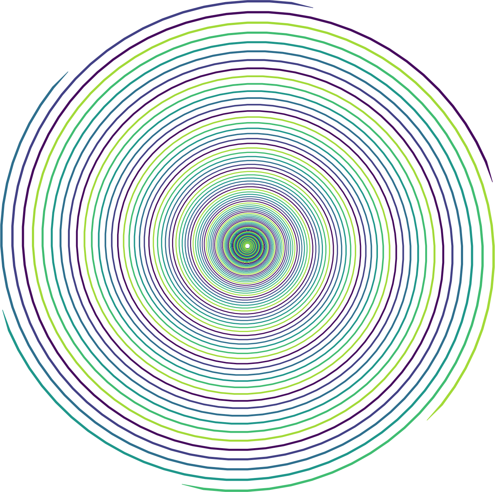

# PolyWhirl


Polywhirl is a tiny program I wrote on a somewhat cramped overnight plane trip to Spain.
It uses the generalized idea of a [Polygon Spiral](http://mathworld.wolfram.com/PolygonalSpiral.html) which I'll call a _Polygon Wedge_ or _wedge_ for short and then plots all wedges. 
For fun, you can control which wedges are plotted by setting a modulus argument, allowing one to make surprisingly beautiful photos such as the one below.



It can also be used as an illustrative teaching tool for introducing polar coordinates as they are a very useful way to express the _n-gons_ and inner n-gon duals for constructing the wedges.

# Usage

```
> python main.py -h
usage: main.py [-h] [--modulus MODULUS] [--cutoff INNER_RADIUS_CUTOFF]
               polygon_sides

Polygon Spiral art creater. Create spiral art!

positional arguments:
  polygon_sides         Number of sides for a polygon (more precisely an
                        n-gon).

optional arguments:
  -h, --help            show this help message and exit
  --modulus MODULUS     Print a spiral for every multiple of modulus arg.
  --cutoff INNER_RADIUS_CUTOFF
                        Print a spiral for every multiple of modulus arg.
```                        
